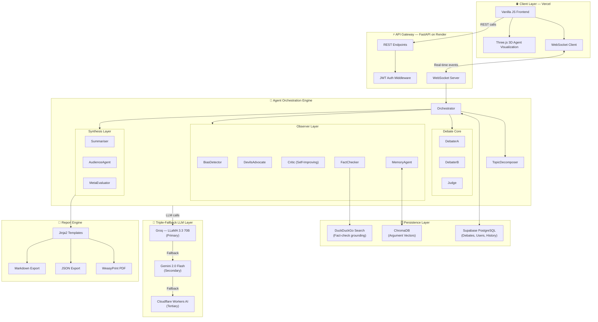
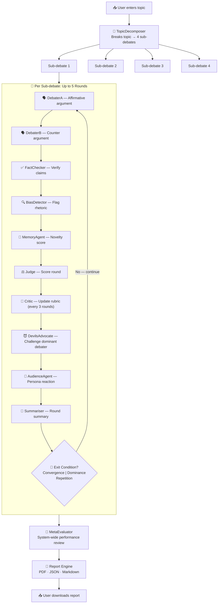
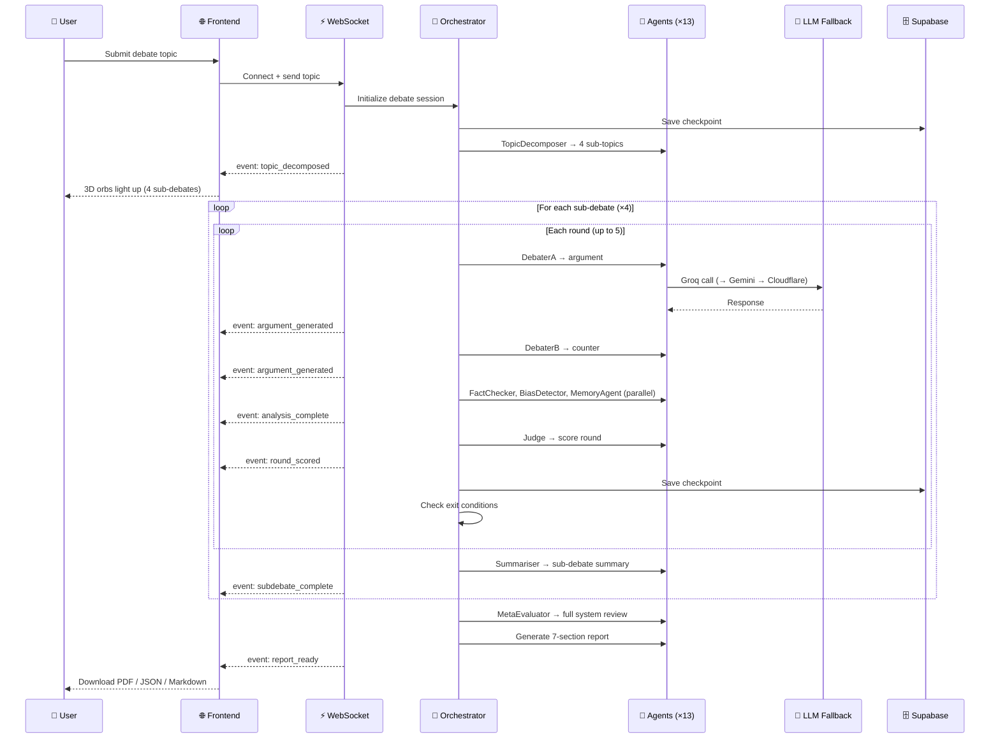

<div align="center">


<br/>


<br/>

[](https://python.org)
[](https://fastapi.tiangolo.com)
[](https://developer.mozilla.org/en-US/docs/Web/API/WebSockets_API)
[](https://supabase.com)
[](https://threejs.org)

[](https://groq.com)
[](https://deepmind.google/technologies/gemini/)
[](https://developers.cloudflare.com/workers-ai/)
[](https://jwt.io)

[](https://dialecta-tau.vercel.app)
[](https://dialecta-backend.onrender.com)
[](https://dialecta-tau.vercel.app)

<br/>

> **DIALECTA** is not a chatbot. It is a structured argumentation engine — a system of thirteen specialized AI agents that decompose any topic into sub-debates, argue in real time across up to 5 dynamic rounds, detect bias, check facts, self-improve their scoring rubric, and synthesize a comprehensive downloadable report. Built from scratch. Deployed to production.

<br/>

---

</div>

## 📌 Table of Contents

- [✨ What Is DIALECTA?](#-what-is-dialecta)
- [🤖 The 13 Agents](#-the-13-agents)
- [🏗️ Architecture](#️-architecture)
- [🔄 Agent Pipeline](#-agent-pipeline)
- [⚡ System Flow](#-system-flow)
- [🚀 Features](#-features)
- [🛠️ Tech Stack](#️-tech-stack)
- [💻 Local Setup](#-local-setup)
- [📄 Report Structure](#-report-structure)
- [🗺️ Roadmap](#️-roadmap)
- [🙏 Built With & Acknowledgements](#-built-with--acknowledgements)

---

## ✨ What Is DIALECTA?

DIALECTA is a **production-deployed, multi-agent AI debate system** that takes any topic — from geopolitics to philosophy to science — and runs it through a rigorous, structured argumentation engine.

A user enters a topic. DIALECTA:

1. **Decomposes** the topic into 4 focused sub-debates
2. **Runs** each sub-debate for up to 5 rounds with two AI debaters
3. **Monitors** every round with six independent critic/observer agents
4. **Self-improves** its own scoring rubric mid-debate
5. **Generates** a 7-section downloadable report in PDF, JSON, and Markdown

This is not RAG over a PDF. This is not a summarizer. This is an orchestrated argumentation system with memory, bias detection, fact-checking, and self-correction — running live.

---

## 🤖 The 13 Agents

<div align="center">

| # | Agent | Role |
|---|-------|------|
| 1 | 🧩 **TopicDecomposer** | Breaks the root topic into 4 targeted sub-debate questions |
| 2 | 🗣️ **DebaterA** | Argues the affirmative/pro position with evidence |
| 3 | 🗣️ **DebaterB** | Argues the negative/contra position with evidence |
| 4 | ⚖️ **Judge** | Scores each round on logic, evidence, clarity, and persuasion |
| 5 | 🔍 **BiasDetector** | Flags rhetorical bias, fallacies, and manipulative language |
| 6 | 😈 **DevilsAdvocate** | Fires when one debater dominates — introduces steelman challenges |
| 7 | 🔬 **Critic** | Rewrites the scoring rubric every 3 rounds (self-improvement) |
| 8 | ✅ **FactChecker** | Verifies factual claims via DuckDuckGo search + LLM fallback |
| 9 | 🧠 **MemoryAgent** | Tracks argument novelty via ChromaDB; detects repetition |
| 10 | 📝 **Summariser** | Produces per-round and per-sub-debate summaries |
| 11 | 👥 **AudienceAgent** | Reacts as a specific persona (policymaker, scientist, layperson, etc.) |
| 12 | 🔭 **MetaEvaluator** | Cross-evaluates the entire debate system's performance |
| 13 | 🎯 **Orchestrator** | Coordinates agent execution order, exit conditions, and state |

</div>

---

## 🏗️ Architecture



---

## 🔄 Agent Pipeline



---

## ⚡ System Flow



---

## 🚀 Features

### 🧠 Intelligence Layer
- **🧩 Automatic Topic Decomposition** — Any topic becomes 4 structured sub-debate questions via the TopicDecomposer agent
- **😈 Dynamic Devil's Advocate** — Automatically activates when one debater's cumulative score crosses a dominance threshold, injecting steelman challenges
- **🔬 Self-Improving Rubric** — The Critic agent rewrites the scoring criteria every 3 rounds based on observed argument quality
- **🧠 Novelty Memory** — ChromaDB vector store tracks all arguments; MemoryAgent computes novelty scores and triggers early exit on repetition
- **✅ Live Fact Checking** — DuckDuckGo search grounds claims in real data; LLM fallback handles rate limiting gracefully

### ⚡ Real-Time Architecture
- **📡 WebSocket Event Streaming** — Every agent action fires a typed event to the frontend in real time
- **🌐 3D Agent Visualization** — Thirteen glowing orbs rendered in Three.js with particle systems; orbs pulse and animate as their agent fires
- **🚪 Dynamic Early Exit** — Debates end early on convergence (score gap < threshold), dominance, or repetition — no padding, no waste
- **💾 Checkpoint System** — Debate state saved to Supabase at every round; debates can be resumed after interruption

### 🔒 Production Hardening
- **🔄 Triple LLM Fallback** — Groq (primary) → Gemini 2.0 Flash (secondary) → Cloudflare Workers AI (tertiary); zero single point of failure
- **🔐 Full Auth Stack** — JWT tokens, Supabase Auth, Google OAuth, GitHub OAuth
- **📜 Persistent History** — All past debates stored and accessible from the sidebar with full transcript replay
- **👥 Audience Personas** — AudienceAgent evaluates each round through the lens of a specific persona (policymaker, scientist, layperson, skeptic)

### 📄 Report Engine
- **7-Section Structured Reports** — Comprehensive analysis covering the full debate lifecycle
- **3 Export Formats** — PDF (WeasyPrint), JSON (machine-readable), Markdown (human-readable)
- **Jinja2 Templating** — Clean, professional report layout with per-section styling

---

## 🛠️ Tech Stack

<details>
<summary><strong>Click to expand full stack breakdown</strong></summary>

<br/>

| Layer | Technology | Purpose |
|-------|-----------|---------|
| **Backend Runtime** | Python 3.11 + FastAPI | Async API server, WebSocket handling |
| **Real-Time** | WebSockets (native FastAPI) | Bi-directional event streaming to frontend |
| **LLM — Primary** | Groq · LLaMA 3.3 70B Versatile | Ultra-fast inference for all 13 agents |
| **LLM — Secondary** | Google Gemini 2.0 Flash | Fallback when Groq quota exhausted |
| **LLM — Tertiary** | Cloudflare Workers AI · LLaMA 3.3 70B FP8 | Final fallback; always available |
| **Database** | Supabase (PostgreSQL) | Debates, users, history, checkpoints |
| **Vector Store** | ChromaDB | Argument embeddings for novelty detection |
| **Fact Checking** | DuckDuckGo Search API | Web grounding for FactChecker agent |
| **Frontend** | Vanilla JS | Lightweight, no-framework client |
| **3D Visualization** | Three.js | Agent orb visualization with particle FX |
| **Report — PDF** | WeasyPrint | HTML/CSS → production PDF rendering |
| **Report — Template** | Jinja2 | Structured 7-section report templating |
| **Auth** | JWT + Supabase Auth + OAuth | Google & GitHub login, token refresh |
| **Frontend Deploy** | Vercel | Global CDN, zero-config deployment |
| **Backend Deploy** | Render | Containerized Python service |
| **Bias Detection** | cross-encoder/nli-MiniLM2-L6-H768 | NLI-based rhetorical bias classification |

</details>

---

## 💻 Local Setup

<details>
<summary><strong>Prerequisites</strong></summary>

- Python 3.11+
- Node.js (for any frontend tooling)
- A Supabase project (free tier works)
- At least one LLM API key: [Groq](https://console.groq.com), [Google AI Studio](https://aistudio.google.com), or [Cloudflare](https://developers.cloudflare.com/workers-ai/)

</details>

### 1. Clone the repository

```bash
git clone https://github.com/MridulSharma02/dialecta.git
cd dialecta
```

### 2. Backend setup

```bash
cd backend
python -m venv venv
source venv/bin/activate       # Windows: venv\Scripts\activate
pip install -r requirements.txt
```

### 3. Environment variables

Create `backend/.env`:

```env
# LLM Keys (triple fallback — configure at least one)
GROQ_API_KEY=your_groq_api_key
GEMINI_API_KEY=your_gemini_api_key
CLOUDFLARE_API_KEY=your_cloudflare_api_key
CLOUDFLARE_ACCOUNT_ID=your_account_id

# Supabase
SUPABASE_URL=https://your-project.supabase.co
SUPABASE_KEY=your_service_role_key
SUPABASE_JWT_SECRET=your_jwt_secret

# App
SECRET_KEY=your_random_secret_key
ALGORITHM=HS256
ACCESS_TOKEN_EXPIRE_MINUTES=60

# OAuth (optional)
GOOGLE_CLIENT_ID=your_google_client_id
GOOGLE_CLIENT_SECRET=your_google_client_secret
GITHUB_CLIENT_ID=your_github_client_id
GITHUB_CLIENT_SECRET=your_github_client_secret
```

### 4. Database migrations

Run the SQL migrations in your Supabase SQL editor — found in `backend/migrations/`.

### 5. Start the backend

```bash
uvicorn main:app --reload --port 8000
```

Backend will be live at `http://localhost:8000`. API docs at `http://localhost:8000/docs`.

### 6. Frontend setup

```bash
cd ../frontend
# No build step required — pure Vanilla JS
# Just update the WebSocket URL in config.js:
```

```javascript
// frontend/config.js
const WS_URL = "ws://localhost:8000/ws/debate";
const API_URL = "http://localhost:8000";
```

Open `frontend/index.html` in your browser, or serve it:

```bash
npx serve .
```

---

## 📄 Report Structure

Every DIALECTA debate generates a **7-section report** in PDF, JSON, and Markdown.

<details>
<summary><strong>View all 7 sections</strong></summary>

<br/>

| # | Section | Contents |
|---|---------|----------|
| **1** | 📋 **Overview** | Topic, timestamp, total rounds, agents used, LLM providers, debate duration, final outcome |
| **2** | 🧩 **Topic Decomposition** | All 4 sub-debate questions with the TopicDecomposer's reasoning for each split |
| **3** | ⚔️ **Sub-Debate Breakdowns** | Per-round arguments (A vs B), fact-check results, bias flags, novelty scores, round scores, exit condition reason |
| **4** | 🔬 **System Self-Improvement Log** | Critic agent's rubric versions — each rewrite with before/after comparison and round trigger |
| **5** | 🔭 **Meta-Evaluation** | MetaEvaluator's assessment of overall debate quality, agent performance scores, system-level insights |
| **6** | ⚖️ **Final Verdict** | Overall winner with Judge's rationale, cumulative scoring breakdown, AudienceAgent final reaction |
| **7** | 📜 **Transcript Appendix** | Full verbatim transcript of all arguments across all sub-debates, all rounds, all agents |

</details>

---

## 🗺️ Roadmap

- [ ] **Voice Mode** — Text-to-speech for each debater with distinct voices
- [ ] **Custom Agent Configs** — Let users swap LLM models per agent
- [ ] **Tournament Mode** — Multiple topics, bracket-style elimination debates
- [ ] **Public Gallery** — Browse anonymized debates from other users
- [ ] **Embedding Export** — Embeddable debate widget for external sites
- [ ] **ChromaDB Cloud** — Migrate from local ChromaDB to managed vector DB
- [ ] **Streaming Tokens** — Token-by-token frontend streaming per agent
- [ ] **Multi-language Support** — Debate in Hindi, Spanish, French

---

## 🙏 Built With & Acknowledgements

<div align="center">

| Technology | What DIALECTA Uses It For |
|-----------|--------------------------|
| [FastAPI](https://fastapi.tiangolo.com) | Async backend, WebSocket server, REST API |
| [Three.js](https://threejs.org) | Real-time 3D agent visualization |
| [Groq](https://groq.com) | Primary LLM inference (LLaMA 3.3 70B) |
| [Google Gemini](https://deepmind.google/technologies/gemini/) | Secondary LLM fallback |
| [Cloudflare Workers AI](https://developers.cloudflare.com/workers-ai/) | Tertiary LLM fallback |
| [Supabase](https://supabase.com) | PostgreSQL database + auth |
| [ChromaDB](https://www.trychroma.com) | Vector store for argument memory |
| [WeasyPrint](https://weasyprint.org) | PDF report generation |
| [Jinja2](https://jinja.palletsprojects.com) | Report templating |
| [Vercel](https://vercel.com) | Frontend deployment |
| [Render](https://render.com) | Backend deployment |

</div>

<br/>

---

<div align="center">

**DIALECTA** was designed and built from scratch by [Mridul Sharma](https://linkedin.com/in/mridul-sharma-a5b9a9408) — B.Tech AI/ML, IILM University (in collaboration with IBM).

*Thirteen agents. Four sub-debates. One system that argues better than most people.*

<br/>

[](https://dialecta-tau.vercel.app)
[](https://github.com/MridulSharma02/dialecta)
[](https://linkedin.com/in/mridul-sharma-a5b9a9408)

<br/>

*If DIALECTA impressed you, a ⭐ on the repo means a lot.*

</div>